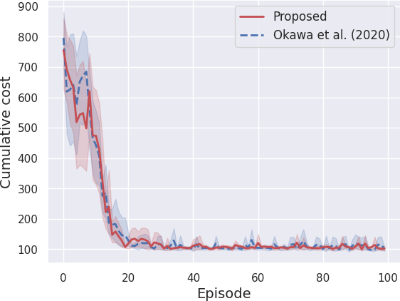
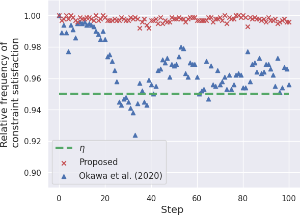
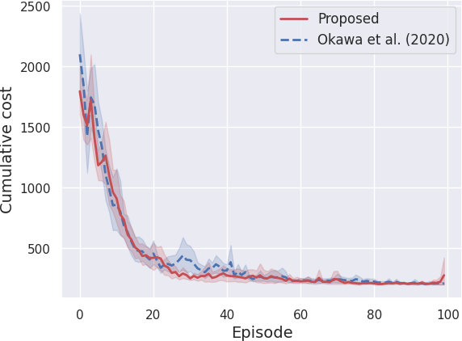
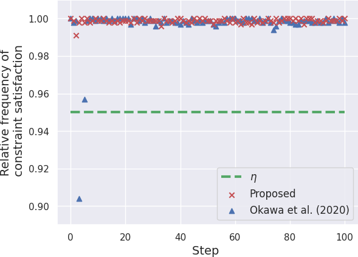

# Safe Exploration Method for Reinforcement Learning under Existence of Disturbance

This repository provides the official code to reproduce the results in the following study.

Yoshihiro Okawa, Tomotake Sasaki, Hitoshi Yanami and Toru Namerikawa. "Safe Exploration Method for Reinforcement Learning under Existence of Disturbance". Submitted to European Conference on Machine Learning and Principles and Practice of Knowledge Discovery in Databases (ECML PKDD) 2022.

## Requirements
Python 3.8.10

To install requirements:

```setup
pip install -r requirements.txt
```

>scipy >= 1.7.0<br>
>tensorflow-gpu >= 2.5.0<br>
>numpy >= 1.19.5<br>
>pandas >= 1.2.5<br>
>gym >= 0.18.3

## Training and Evaluation

To train models with an evaluation of the safe exploration method proposed in the paper, run each command:

```train and evaluate
python ./code/inverted_pendulum/main_SafeEx_ECMLPKDD2022_Pend.py  #inverted pendulum
python ./code/robot_manipulator/main_SafeEx_ECMLPKDD2022_Mani.py  #four-bar parallel link robot manipulator
```

> You can train models and reproduce the results of cumulative costs and relative frequencies of constraint satisfaction shown in the paper (Figure 3) with the above command. If you want to change parameter and/or hyperparameter settings of this simulation, please change them written in codes.


#### training data
> As in a general problem setting of reinforcement learning, training data, i.e., a set of states, inputs and their corresponding immediate costs, are automatically generated and used (but not stored) in the above code.


## Results (Figure 3 in the paper)

Throughout the simulation, we obtain the followoing figures by plotting results saved in csv files:

|                      Problem                     |                       Cumulative cost                        |        Relative frequency of constraint satisfaction         |
| :----------------------------------------------------------: | :----------------------------------------------------------: | :----------------------------------------------------------: |
| Inverted pendulum |     |     |
|                          Four-bar parallel link robot manipulator                          |  |  |


## Pre-trained Models

You can also find the pretrained models (actor and critic networks trained in the last trial with each method) in the directory "result_paper".


## Evaluation (optional)

We do not guarantee success in training to swing up and hold an pendulum or to regulate links of the robot manipulator in our paper; however, if you want to evaluate trained models, run each command:

```
python ./code/inverted_pendulum/eval_SafeEx_ECMLPKDD2022_Pend.py
python ./code/robot_manipulator/eval_SafeEx_ECMLPKDD2022_Mani.py
```

For example, if you want to evaluate the above pre-trained models stored in the directory "result_paper", run each command:

```
python ./code/inverted_pendulum/demo_SafeEx_ECMLPKDD2022_Pend.py
python ./code/robot_manipulator/demo_SafeEx_ECMLPKDD2022_Mani.py
```


## Licence
This project is under the BSD 3-Clause Clear License. See [LICENSE](LICENSE) for details.
